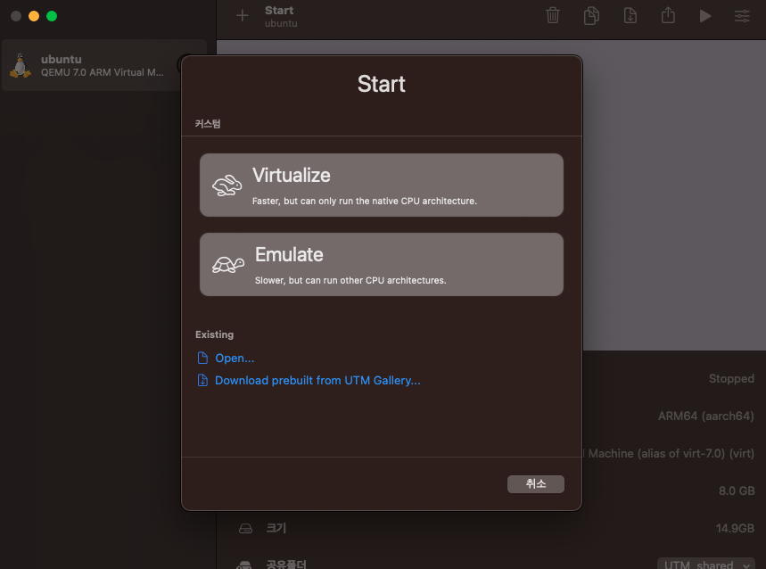
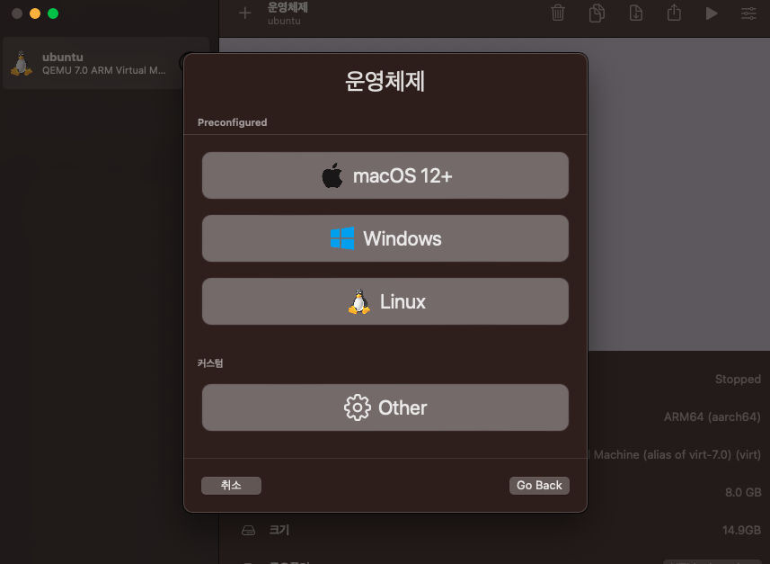

# 1. Docker or Virtual Machine

## 1.1. mac OS

### 1.1.1. set lima for docker

[참조](https://qiita.com/akinami/items/d38b9e7c7f37bd070f40)

#### 1.1.1.1. Install

```powershell
brew install wget
brew install lima	# for docker daemon
brew install docker	# for docker
brew install docker-compose
```

##### 1.1.1.1.1. Init

- docker 세팅을 위한 파일 다운로드

```powershell
wget https://github.com/lima-vm/lima/raw/master/examples/docker.yaml
```

- docker.yaml 파일을 수정

```yml
# 각 항목을 추가
# mounts:
# location: "~"
writable: true

# docker hw 할당
cpus: 2
memory: "8GiB"
disk: "20GiB"

# ssh에 의해 에러가 일어날 가능성이 있다고 함
ssh:
  loadDotSSHPubKeys: false
  localPort: 60006
```

- 파일 수정이 완료되면 가상환경 생성

```powershell
limactl start ./docker.yaml
```

- 가상 환경을 변경하고자 할 경우에는 기존 환경을 삭제하고
- 재생성하여야 함

```powershell
# stop
limactl stop docker
# remove
limactl rm docker # docker : name
```

##### 1.1.1.1.2. 환경 변수 설정

- .zshrc 파일 수정

```powershell
export DOCKER_HOST=unix:///${HOME}/.lima/docker/sock/docker.sock
```

- 컴퓨터 시작 시 가상환경이 자동으로 시작되고 싶다면 다음을 .zshrc에 추가

```powershell
limactl start docker
```

- 위를 통해 docker를 구동하기 위한 가상 환경 구축은 완료

### 1.1.2. docker 환경 구축

```powershell
docker
```

- lima 세팅 전에는 docker 명령어 시 오류가 발생하지만,
- lima 세팅 후에는 정상 동작하는 것을 확인할 수 있음

#### 1.1.2.1. image download

```powershell
docker search ubuntu		# ubuntu : 이미지 이름
docker pull ubuntu:18.04	# ubuntu 18.04 버전을 다운로드
docker images 				# 다운 받은 이미지를 확인할 수 있음
```

#### 1.1.2.2. container 생성

```powershell
docker create -i -t --name [name] ubuntu:18.04
# -i와 -t는 컨테이너와 상호 입출력을 가능하게 하는 옵션
# --name : 컨테이너 이름을 지정
```

#### 1.1.2.3. container 작동

```powershell
docker start [name]		# container 실행
docker attach [name]	# container 접속
```

### 1.1.3. VSCODE를 통한 원격접속

- vscode에서 지원하는 플러그인을 설치
- remote-containers와 Docker 플러그인 설치

#### 1.1.3.1. settings.json 수정

- [F1] 키를 통해 settings.json 파일을 로드
- 다음 항목 추가

```powershell
# add
"docker.host": "unix:///Users/twchong/.lima/docker/sock/docker.sock"
```

- vscode의 docker 창에서 container를 확인할 수 있음

### 1.1.4. 추가 확인 필요

#### 1.1.4.1. network

- container 상에서는 ifconfig를 통해 171.17. 단 IP를 확인할 수 있는데
- macos 상에서는 해당 IP를 확인할 수 없어서 상호 통신이 가능한지 추가 확인 필요함

### 1.1.5. Virtual Machine

#### 1.1.5.1. UTM

[homepage](https://mac.getutm.app/)

[support](https://docs.getutm.app/)

[참조0-ui까지 설치 시](https://ssunw.tistory.com/entry/M1-mac-%EA%B0%80%EC%83%81%ED%99%98%EA%B2%BD%EC%97%90-Linux-%EC%84%A4%EC%B9%98%ED%95%98%EA%B8%B0UTM-Ubuntu), [참조1-터미널만](https://antdev.tistory.com/84), [참조2-터미널만](https://blog.chnrit.com/applesilicon-mac-install-ubuntu-vm-utm3x/)

- docker desktop의 유료화, VMware, virtual box 등의 애플 실리콘 모델 미지원으로 인해
- 가상 환경 구동에 제한이 있어서, 애플 실리콘에서 구동 가능한 가상 머신인 UTM을 사용

##### install

- 홈페이지에서 설치 파일을 다운받아서 설치

##### OS iso 다운로드

[다운로드 링크](https://ubuntu.com/download/server/arm)

- 우분투를 설치하기 위해서 위 링크를 통해 arm 버전의 우분투를 다운로드

##### 가상머신 생성



- Virtualize 선택



1. 가상머신에 설치하려는 운영체제 선택, 본 문서에서는 Linux을 선택
2. [ browse... ]로 os iso 파일을 선택
3. cpu 개수, 스토리지 용량을 설정

##### ubuntu server 설치

1. 우분투 실행
2. GNU 창이 출력되면 [Try or Install Ubuntu Server] 선택
3. 언어, 키보드, 네트워크, 디스크 등을 참조 사이트를 참조하여 설치 진행
4. 설치가 완료되면 가상머신 재부팅
5. 디스크 제거

##### GUI 세팅

- 현재 설치된 우분투는 UI는 지원하지 않는 버전
- UI를 지원하기 위해서는 추가적인 설치 과정이 필요
- 우분투 가상머신 실행

```powershell
sudo apt install tasksel -y
sudo tasksel install ubuntu-desktop
```

- 해당 설치 과정을 수행하면 UI가 있는 우분투로 변경됨

##### ERROR

- UI 창이 제대로 보정되지 않고 잘리는 경우가 발생
- M2 mac 기준으로 우분토 display 설정을 1920 x 944으로 해야
- 전체 화면 시 ui가 잘리지 않고 출력됨.
