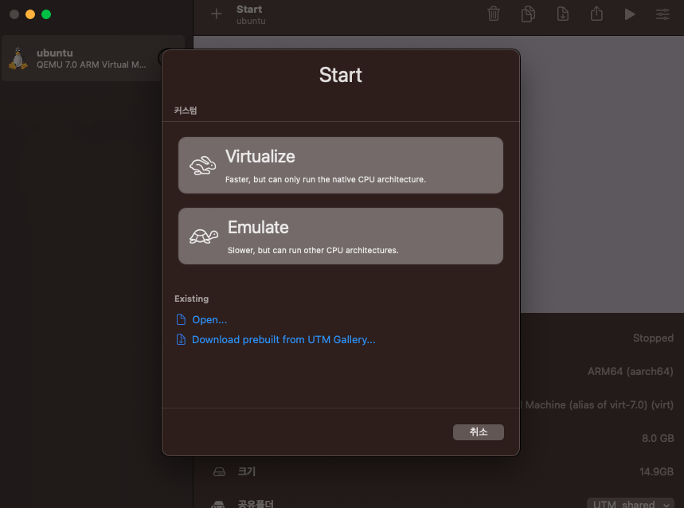

# UTM

[homepage](https://mac.getutm.app/)

[support](https://docs.getutm.app/)

[참조0-ui까지 설치 시](https://ssunw.tistory.com/entry/M1-mac-%EA%B0%80%EC%83%81%ED%99%98%EA%B2%BD%EC%97%90-Linux-%EC%84%A4%EC%B9%98%ED%95%98%EA%B8%B0UTM-Ubuntu), [참조1-터미널만](https://antdev.tistory.com/84), [참조2-터미널만](https://blog.chnrit.com/applesilicon-mac-install-ubuntu-vm-utm3x/)

- docker desktop의 유료화, VMware, virtual box 등의 애플 실리콘 모델 미지원으로 인해
- 가상 환경 구동에 제한이 있어서, 애플 실리콘에서 구동 가능한 가상 머신인 UTM을 사용

## install

- 홈페이지에서 설치 파일을 다운받아서 설치

## OS iso 다운로드

[다운로드 링크](https://ubuntu.com/download/server/arm)

- 우분투를 설치하기 위해서 위 링크를 통해 arm 버전의 우분투를 다운로드

## 가상머신 생성



- Virtualize 선택


1. 가상머신에 설치하려는 운영체제 선택, 본 문서에서는 Linux을 선택
2. [ browse... ]로 os iso 파일을 선택
3. cpu 개수, 스토리지 용량을 설정

## ubuntu server 설치

1. 우분투 실행
2. GNU 창이 출력되면 [Try or Install Ubuntu Server] 선택
3. 언어, 키보드, 네트워크, 디스크 등을 참조 사이트를 참조하여 설치 진행
4. 설치가 완료되면 가상머신 재부팅
5. 디스크 제거

## GUI 세팅

- 현재 설치된 우분투는 UI는 지원하지 않는 버전
- UI를 지원하기 위해서는 추가적인 설치 과정이 필요
- 우분투 가상머신 실행

```powershell
sudo apt install tasksel -y
sudo tasksel install ubuntu-desktop
```

- 해당 설치 과정을 수행하면 UI가 있는 우분투로 변경됨

## ERROR

- UI 창이 제대로 보정되지 않고 잘리는 경우가 발생
- M2 mac 기준으로 우분토 display 설정을 1920 x 944으로 해야
- 전체 화면 시 ui가 잘리지 않고 출력됨.
