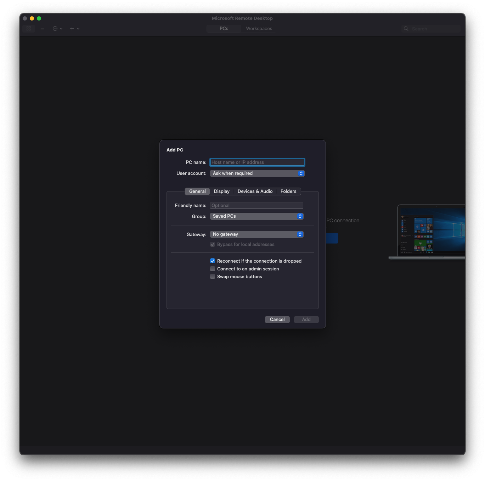

# Multipass

[multipass](https://multipass.run/)

## Mac OS

[multipass-install](https://multipass.run/docs/installing-on-macos)

[참조](https://elsainmac.tistory.com/870)

### install

```bash
Brew install —cask multipass
```

## Ubuntu img List

### find

```bash
multipass find
```


### install img

```bash
multipss launch 22.10 -n [가상머신이름] -c 4 -m 4G -d 100G
```

- launch : 설치 및 실행
- 22.10 : 우분투 설치 버전, find에서 확인
- -n : 가상머신의 이름
- -c : 가상머신에 할당할 코어의 개수
- -m : 가상머신에 할당할 메모리 크기
- -d : 가상머신에 할당할 디스크 크기

- 자동실행된다고 하지만, 프로그램이 메뉴바에 출력되지 않을 경우 앱 목록에서 직접 실행


#### open shell


- 사용자명은 ubuntu, 비밀번호는 없음
- 또는 현재 터미널에서 다음의 명령어를 통해 연결

```bash
multipass shell [가상머신이름]
```

### shared Directory

```bash
multipas mount /shared_directory_path [가상머신이름]:/home/ubuntu/share
```


### info

```bash
multipass info [가상머신 이름]
```

- 가상머신의 각종 정보를 확인할 수 있음

### list

```bash
multipass list
```

- 생성한 가상머신 목록 확인

### unmount

```bash
multipass umount [가상머신 이름]
```

- 가상머신 off

### deleted vitual mechine

```bash
multipass umount [가상머신 이름]
multipass stop [가상머신 이름]
multipass delete [가상머신 이름]
multipass purge [가상머신 이름]
```

- delete 후 list로 목록을 확인하면
- 아직 남아있는 것을 확인할 수 있음
- purge까지 수행해야 완전히 삭제

### ERROR

```bash
multipass ls
# list failed: The client is not authenticated with the Multipass service.
# Please use 'multipass authenticate' before proceeding.

sudo launchctl unload /Library/LaunchDaemons/com.canonical.multipassd.plist

sudo rm /var/root/Library/Application\ Support/multipassd/authenticated-certs/multipass_client_certs.pem

sudo cp ~/Library/Application\ Support/multipass-client-certificate/multipass_cert.pem /var/root/Library/Application\ Support/multipassd/authenticated-certs/multipass_client_certs.pem

sudo launchctl load /Library/LaunchDaemons/com.canonical.multipassd.plist
```

- instance가 실행되지 않는 문제...
- 방화벽을 off하니 정상동작 함

### set DEV env

#### sources.list

- mac에서 구동하기 때문에 코어가 arm64라서
- 특정 app을 설치하지 못하는 문제 발생

```bash
sudo vim /etc/apt/sources.list

# add list in sources.list
# kinetic 

deb http://ports.ubuntu.com/ubuntu-ports jammy main restricted universe multiverse
deb http://ports.ubuntu.com/ubuntu-ports jammy-updates main restricted universe multiverse
deb http://ports.ubuntu.com/ubuntu-ports jammy-backports main restricted universe multiverse
deb http://ports.ubuntu.com/ubuntu-ports jammy-security main restricted universe multiverse
deb http://archive.canonical.com/ubuntu jammy partner

# save & exit

sudo apt-get update
```

#### zsh

```bash
sudo apt-get install zsh
```

- oh-my-zsh 설치

```bash
sh -c "$(wget -O- https://raw.githubusercontent.com/ohmyzsh/ohmyzsh/master/tools/install.sh)"
```

- power level10k theme 설치

```bash
git clone --depth=1 https://github.com/romkatv/powerlevel10k.git ${ZSH_CUSTOM:-~/.oh-my-zsh/custom}/themes/powerlevel10k
```

- Plugin : zsh-autosuggestions 

```bash
git clone https://github.com/zsh-users/zsh-syntax-highlighting.git ${ZSH_CUSTOM:-~/.oh-my-zsh/custom}/plugins/zsh-syntax-highlighting
```

- Plugin : zsh-syntax-highlighting

```bash
git clone https://github.com/zsh-users/zsh-autosuggestions ${ZSH_CUSTOM:-~/.oh-my-zsh/custom}/plugins/zsh-autosuggestions
```

- add plugin in zshrc

```bash
# vim ~/.zshrc

plugins = (
	git
	zsh-autosuggestions
	zsh-syntax-highlighting
)
```

#### docker

- docker ps -a permission error

```bash
sudo chmod 666 /var/run/docker.sock
```

- delete all containers

```bash
docker rm $(docker ps --filter 'status=exited' -a -q)
```

## ubuntu GUI

### install ui tools

#### vitual mechine

- desktop ui 설치

```bash
sudo apt-get update
sudo apt-get upgrade
sudo apt-get install ubuntu-desktop xrdp -y
```

- 비밀번호 설정

```bash
sudo passwf [user]
# input password
```

#### Mac OS

- app store에서 **Microsoft Remote Desktop** 설치

#### setting

- [add pc]로 원격 접속할 구성 만들기


- PC name에는 가상머신의 IP주소를 입력
- 가상 머신의 IP주소는 multipass info [가상머신 이름]으로 확인할 수 있음




- 원격접속하기 위한 구성이 생성됨을 확인


- 더블클릭으로 동작
- 원격접속을 하기 위한 로그인


#### result


