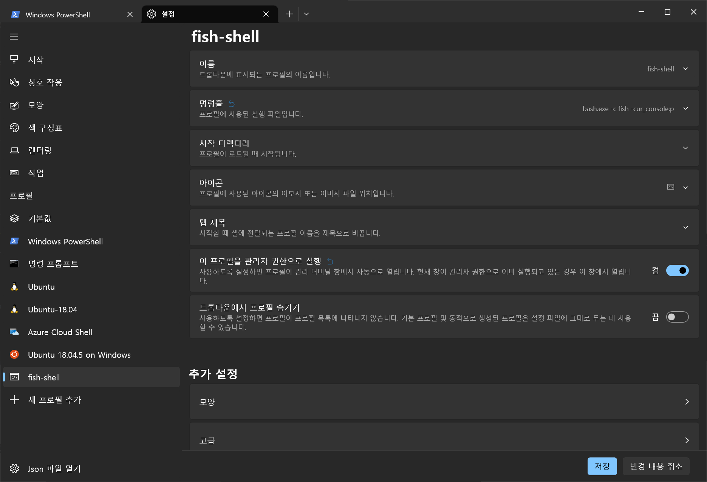
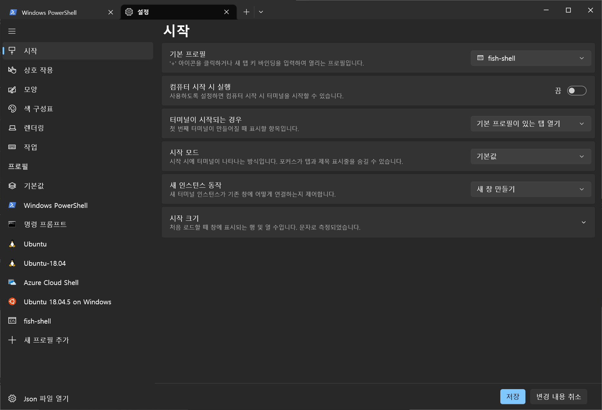
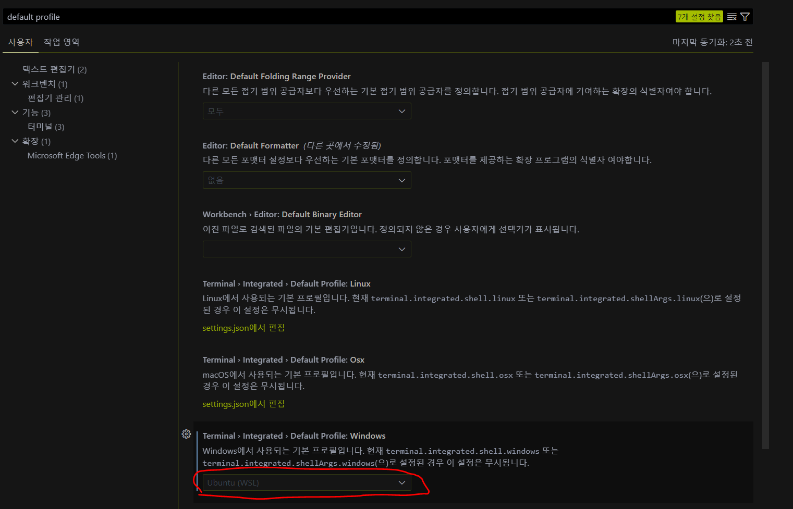
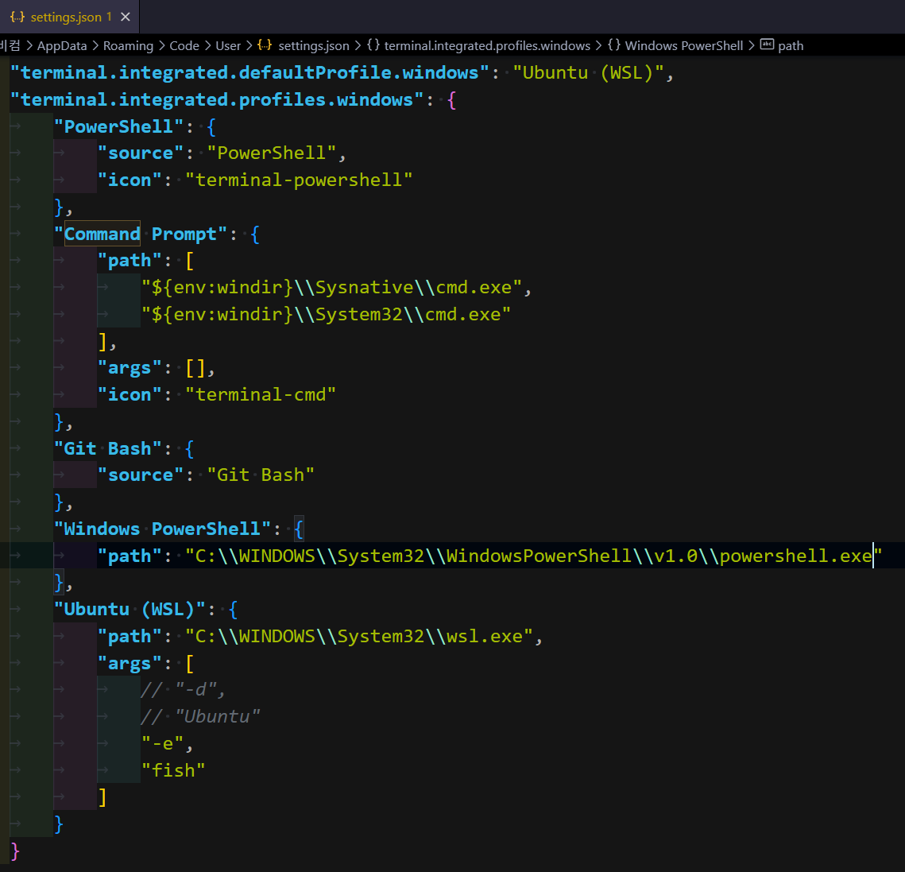

# Termianl Settings

## windows

### fishShell

[fish shell](https://fishshell.com/)

#### install

~~1. [Cygwin](https://cygwin.com/) 설치~~

1. power shell 또는 cmd 창에서 wsl 동작

  ```bash
  sudo apt-get update
  sudo apt-get upgrade
  ```

2. fish shell 설치

  ```bash
  sudo apt-get install fish
  ```

3. power shell 또는 cmd에서 다음 명령어 실행

  ```bash
  bash - cfish -cur_console:p
  ```

4. 설정 항목에서 다음과 같이 세팅




5. oh-my-fish 설치

  ```bash
  curl -L https://get.oh-my.fish | fish
  ```

6. 테마 설정

[테마 github](https://github.com/oh-my-fish/oh-my-fish/blob/master/docs/Themes.md)

```bash
  omf install [theme-name]
 ```

7. Vscode terminal 변경
   - [crtl] + , 로 세팅 창을 엶
   - default profile을 검색해서
   - windows의 default terminal을 wsl로 변경
  
   - 하지만 이는 내 환경에서는 동작하지 않음
   - 이를 해결하기 위해 setting.json을 수정

8. 7번 항목이 안될 경우 setting.json 파일을 수정
   - [F1] 키
   - open setting.json
   - terminal.integrated.profiles.windows에서 Ubuntu(WSL)의 args 값을 변경
  

9. vscode의 터미널 창이 변경되는 것을 확인할 수 있음

## UBUNTU

## MAC

[홈페이지](https://brew.sh/index_ko)

- 패키지 관리 툴 설치

```powershell
/bin/bash -c "$(curl -fsSL https://raw.githubusercontent.com/Homebrew/install/HEAD/install.sh)"
```

### iterm2

[참조](https://danaing.github.io/etc/2022/03/28/M1-mac-iTerm2-setting.html)

```powershell
brew install iterm2
```

## common

### Oh-my-zsh

[홈페이지](https://ohmyz.sh/#install)
[참조](https://danaing.github.io/etc/2022/03/28/M1-mac-iTerm2-setting.html)

- 터미널 툴을 변경

#### install

##### Mac

```powershell
sh -c "$(curl -fsSL https://raw.githubusercontent.com/ohmyzsh/ohmyzsh/master/tools/install.sh)"
```

##### ubuntu

```powershell
sudo apt-get instal zsh # install
chsh -s /usr/bin/zsh    # convert bash to zsh
sh -c "$(wget https://raw.githubusercontent.com/robbyrussell/oh-my-zsh/master/tools/install.sh -O -)"
```

#### plugin

##### autoComplete

```powershell
git clone https://github.com/zsh-users/zsh-autosuggestions ${ZSH_CUSTOM:-~/.oh-my-zsh/custom}/plugins/zsh-autosuggestions
```

##### Syntax Highlight

```powershell
git clone https://github.com/zsh-users/zsh-syntax-highlighting.git ${ZSH_CUSTOM:-~/.oh-my-zsh/custom}/plugins/zsh-syntax-highlighting
```

#### my zshrc setting

```powershell
# vim ~/.zshrc

plugins=(
    #other plugin
    zsh-autosuggestions
    zsh-syntax-highlighting
)
```

#### vscode 연동

- 명령어 추가
  
```bash
# ~/.zshrc
vscode() { VSCODE_CWD="$PWD" open -n -b "com.microsoft.VSCode" --args $* ;}
```

- vscode 실행

```bash
cd [dir]
vscode .
```

### fig

[홈페이지](https://fig.io/)
[참조](https://fig.io/user-manual/linux#fig-autocomplete-window-is-stuck-at-the-top-left-ibus-not-running)

- 커맨드 라인 툴
- 자동 완성등을 지원

#### mac

```powershell
# install
brew install fig

# login
fig login    # using github or email

# check fig
fig doctor    

# restart
fig restart
```

#### ubuntu

```powershell
bash <(curl -fSsL https://fig.io/headless.sh) && exec $SHELL
sudo apt-get install fig    # re-install with gui

# login
fig login    # using github or email

# check fig
fig doctor    

# restart
fig restart
```

#### ERROR

##### path of ( ~/.bashrc )

```powershell
fig doctor
fig restart
```

##### path of ( ~/.local/bin )

```powershell
sudo chown -R $(id -un) ~/.local
fig doctor
fig restart
```

- 안된다면 터미널을 재실행

#### GTK_IM_MODULE ibus

- 자동완성 창이 상단 왼쪽에 출력되는 문제

```powershell
# Error Messgae : IBus Env Check: IBus environment variable is not setting

# add gtk_im_module
# ~/.bashrc or ~/.zshrc
export GTK_IM_MODULE=ibus
```

- **에러는 없어지는데 자동완성 창은 여전히 왼쪽 상단에 출력됨**
