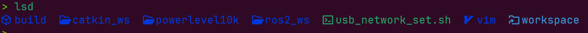

# Termianl

나의 터미널 세팅 관련하여 정리한 markdown입니다.

## oh-my-zsh

[홈페이지](https://ohmyz.sh/#install)
[참조](https://danaing.github.io/etc/2022/03/28/M1-mac-iTerm2-setting.html)

- 터미널 툴을 변경

### INSTALL

#### Mac

##### brew

[홈페이지](https://brew.sh/index_ko)

- 패키지 관리 툴 설치

```bash
/bin/bash -c "$(curl -fsSL https://raw.githubusercontent.com/Homebrew/install/HEAD/install.sh)"
```

##### iterm2

[참조](https://danaing.github.io/etc/2022/03/28/M1-mac-iTerm2-setting.html)

```bash
brew install iterm2
```

```bash
sh -c "$(curl -fsSL https://raw.githubusercontent.com/ohmyzsh/ohmyzsh/master/tools/install.sh)"
```

#### ubuntu

```bash
# zsh install
sudo apt-get instal zsh

chsh -s /usr/bin/zsh    # convert bash to zsh

sh -c "$(wget https://raw.githubusercontent.com/robbyrussell/oh-my-zsh/master/tools/install.sh -O -)"
```

### zsh-plugin

#### autoComplete

```bash
git clone https://github.com/zsh-users/zsh-autosuggestions ${ZSH_CUSTOM:-~/.oh-my-zsh/custom}/plugins/zsh-autosuggestions
```

#### Syntax Highlight

```bash
git clone https://github.com/zsh-users/zsh-syntax-highlighting.git ${ZSH_CUSTOM:-~/.oh-my-zsh/custom}/plugins/zsh-syntax-highlighting
```

#### zshrc

```bash
# add in ~/.zshrc
# vim ~/.zshrc

plugins=(
    #other plugin
    git
    zsh-autosuggestions
    zsh-syntax-highlighting
)
```

## powerlevel10k

[LINK](https://github.com/romkatv/powerlevel10k)

### INSTALL

```bash
git clone --depth=1 https://github.com/romkatv/powerlevel10k.git ~/powerlevel10k
echo 'source ~/powerlevel10k/powerlevel10k.zsh-theme' >>~/.zshrc

source ~/.zshrc
```

## lsd

[LINK](https://github.com/lsd-rs/lsd)

### INSTALL

```bash
# package tool
sudo apt-get install cargo

# install lsd
cargo install lsd
```

### run

```bash
lsd
```

#### result



### ERROR

```bash
lsd
# zsh : command not found: lsd

sudo cp ~/.cargo/bin/lsd /usr/bin
```

### alias

```bash
# ~/.zshrc
alias ls='lsd'

# source zshrc
source ~/.zshrc
```

## ELSE

### fig

[홈페이지](https://fig.io/)
[참조](https://fig.io/user-manual/linux#fig-autocomplete-window-is-stuck-at-the-top-left-ibus-not-running)

- 커맨드 라인 툴
- 자동 완성등을 지원

#### mac

- 아마존에 흡수되면서 codewhisper에 통합됨

```bash
# install
brew install fig

# login
fig login    # using github or email

# check fig
fig doctor    

# restart
fig restart
```
