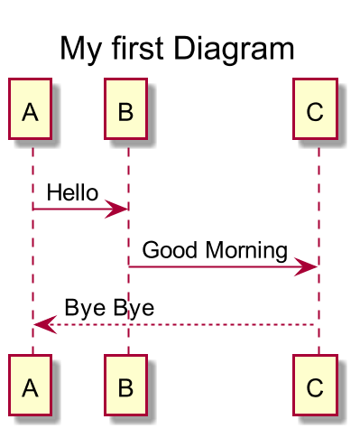

# PlantUML

[PlantUML]: https://plantuml.com/ko/


## 설치

- vscode와 연동해서 PlantUML 사용

- JAVA 설치

- graphviz 설치

  - [홈페이지]: http://www.graphviz.org/download/

- vscode에서 확장에서 plantUML 설치

## 예제

```css
@startuml

scale 2
title My first Diagram

A -> B : Hello
B -> C : Good Morning
C --> A : Bye Bye

@enduml
```

- 명령어를 통해 확인 가능
  - plantUML: preview current diagram

## 출력

- 명령어를 통해 이미지 파일로 출력
- plantUML : export current diagram
- 확장자 선택 후 이미지가 생성됨


